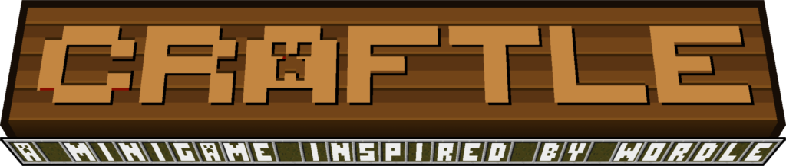

# **CRAFTLE**  ~  一个仿WORDLE的MC小游戏

      
</p
这是一个类似于wordle的mc合成表小游戏

这里有：

* 类wordle的规则
* 两个队伍之间的竞技内容
* 即插即用的原版数据包体验

## 安装&游玩

推荐使用1.21.11版本游玩此数据包

你只需要:

1. 新建一个世界
2. 打开存档文件夹，找到你新建的世界并打开
3. 将craftle-datapack放入世界文件夹的datapacks文件夹内
4. 回到游戏并输入/reload（需要开启作弊）或是退出重进世界
5. 安装提供的资源包（其实不装也行，看你心情了）
6. 你的聊天栏应该会自动弹出游戏选择，按t打开聊天栏并使用鼠标点击即可

## 规则

相较于wordle的小字符大字典的形式，mc合成表无疑是元素多而合成表少的。
所以我们对游戏规则做了改动，同时也使我们编写数据包工作量减小了一些
~才不是懒呢~

以下是与wordle规则相近的内容：

* 如果提交的物品在选定的合成表中存在且位置正确，将会输出绿色色块
* 如果提交的物品在选定的合成表中存在但位置错误，将会输出黄色色块
* 如果提交的物品在选定的合成表中不存在，将会输出红色色块

以下是与wordle规则不同的内容:

* 黄色色块仅指示该物品存在且位置不对，并不会指示物品数量
* 本游戏对玩家提交的内容不做限制，玩家可以提交非合成表内容，但答案一定是一个合成表
* 对提交的次数不做限制，但同一队伍共用一个提交冷却 - 当前是**两分钟**
* 所有玩家在生存模式下收集物品并进行猜测，先猜出合成表的队伍胜利

## 回报问题

如果你在游玩中遇到了任何问题，欢迎在issue中向我汇报

## 技术性内容

* 该数据包在1.21.11版本中编写，并且应该支持1.21.X的版本（this_hacker告诉你不支持，因为加了非常新的配方嘿嘿嘿）
* 该数据包使用函数宏进行判断  ~写的非常石所以不建议参考~
* 一个答案列表存储，你可以按照需求向里面添加新的合成表（或者只是随机的物品，甚至是其他模组中的物品！）该数据包应该会正常的处理这些数据

## 作者

* Aurelith/Mxpea 负责了数据包所有逻辑的开发，以及材质包的绘制  
  b站链接：https://space.bilibili.com/517011791
* Nekoviet13 负责了配方的筛选和导入
* this_hacker 负责了数据包部分逻辑开发的指导，负责了非常多配方的筛选和导入，提出了非常多建议，贡献巨大  <-巨大在哪
  b站链接：https://space.bilibili.com/526122347

